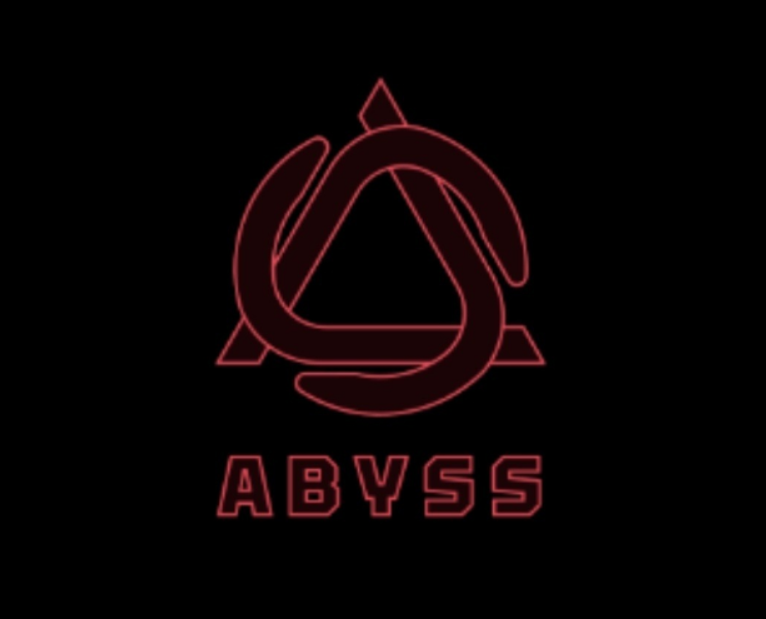
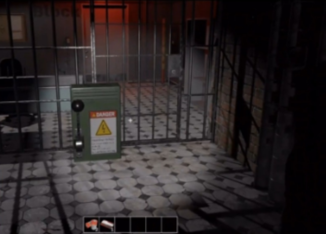
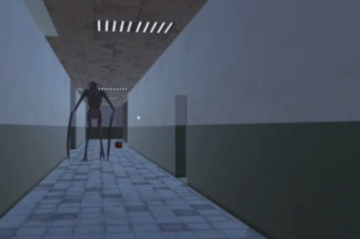
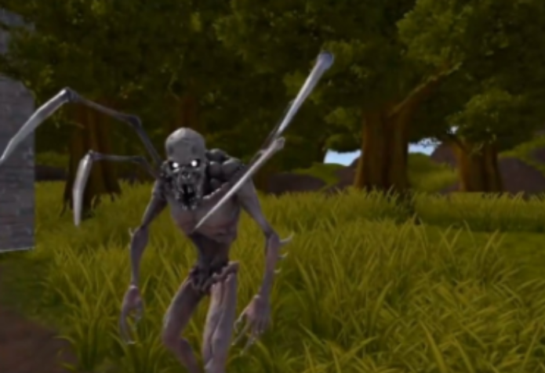

# 👁️ Abyss

---

## 📌 프로젝트 개요
- **플랫폼** : PC 
- **장르** : 협동 · 생존 · 공포  
- **기획 의도** : 멀티플레이 협동 기반의 공포 게임 제작  
- **팀 구성** : 5인
- **개발 기간** : 2024.12 ~ 2025.02 (3개월)  

---

## 🎮 스토리

10년 전, 세 명의 플레이어들이 납치되어 감옥 건물에 갇혔다.  
정신을 잃은 채로 눈을 뜬 순간, 감옥은 이미 폐허가 되어 있었고 안에는 인간을 개조한 괴생명체들이 돌아다니고 있었다.  

플레이어는 폐건물 곳곳에서 단서를 수집하며 끔찍한 실험의 진실을 마주하고,  
동시에 **엔진 3개를 구동해 탈출구를 열고 도망쳐야 한다.**  

그러나 탈출 후에도 충격적인 진실이 기다리고 있는데…

---

## ⚙️ 주요 시스템

### 🏚️ 맵 & 구조
- 랜덤 스폰 시작 지점 (플레이어 3명 각각 다른 위치)  
- 다수의 방 → 복잡한 탈출 루트  
- 숨을 수 있는 캐비넷 배치  
- 어둡고 제한된 시야 → 손전등 사용  

### 👾 몬스터
- **소리 몬스터** : 달리기, 오르골 등 소리를 추적  
- **어둠 몬스터** : 빛이 없는 공간에서만 이동, 어두운 곳에서 플레이어를 공격   

### 🔦 아이템
- **손전등** : 기본 지급 (건전지 소모, 1개 = 1분)  
- **건전지** : 손전등 및 엔진 작동용  
- **오르골** : 소리 몬스터 유인
- **전선** : 엔진 작동용

### ⚙️ 엔진 (총 3개, 랜덤 위치)
1. **협동형** : 두 명이 동시에 10초간 작동  
2. **전선형** : 특정 색상의 전선을 2개 꽂아야 구동  
3. **암전형** : 건전지 3개 필요, 구동 시 맵 전체 암전 (1분)  

→ 세 엔진을 모두 구동 시, **탈출구 개방**

### 🕹️ 조작법
- `WASD` : 이동  
- `Space` : 점프  
- `Ctrl` : 웅크리기 
- `Shift` : 달리기  
- `Mouse Left` : 아이템 사용
- `Mouse Right` : 아이템 획득
- `F` : 손전등 켜기
- `E` : 인벤토리 

---

## 🧩 게임 목표
- 맵 곳곳을 탐색하며 **아이템을 수집하고 엔진 3개를 구동**  
- 괴생명체의 추적을 피하고, 팀원과 협력해 탈출구까지 이동  

---

## 🛠️ 기술 스택
- **Unity 3D** (게임 엔진)  
- **C#** (게임 로직)  
- **Photon** (멀티플레이 서버 구축)  
- **GitHub** (버전 관리 및 협업)
- **Notion** (개발 진행상황 공유 및 협업)

---

## 📸 실제 플레이 화면

---

## 🚀 실행 방법
1. Unity에서 프로젝트 열기  
2. `Build Settings` → PC (Windows) 선택  
3. exe 파일 빌드 후 실행  

---

## 👥 Contributors

### 정유라 (팀장, 서버 개발)  
- 기획 및 서버 개발
- 이동 & 회전 동기화 
- 노트 시스템  
- 플레이어 모션 서버 연동

### 김지윤 (서버 개발)  
- 매칭메이킹 
- 플레이어 스폰 시스템  
- 엔진 시스템  
- 몬스터 기능 및 소리 Photon 연동  

### 최선호 (클라이언트 개발)  
- 인벤토리 제작  
- 손전등/배터리 구현  
- 아이템 사운드 추가  
- 리스폰 기능 구현  
- 엔딩 컷씬 기획 및 제작  

### 서가은 (클라이언트 개발) 
- 플레이어 이동 및 조작, 상태 구현
- 어둠 몬스터 AI 구현
- 플레이어, 몬스터 애니메이션 연동  
- 플레이어 안전구역 구현  
- 맵 렌더링 세부 처리

### 송채강 (클라이언트 개발)
- 맵 구현
- 오르골 구현 
- 소리 몬스터 AI 구현  
- 플레이어, 몬스터 소리 연동
- 점프 스케어 구현

 ---

 ## 🏆 수상
- 숙명여자대학교 중앙 프로그래밍 동아리 Solux 24-2 프로젝트 발표회 **최우수상**

